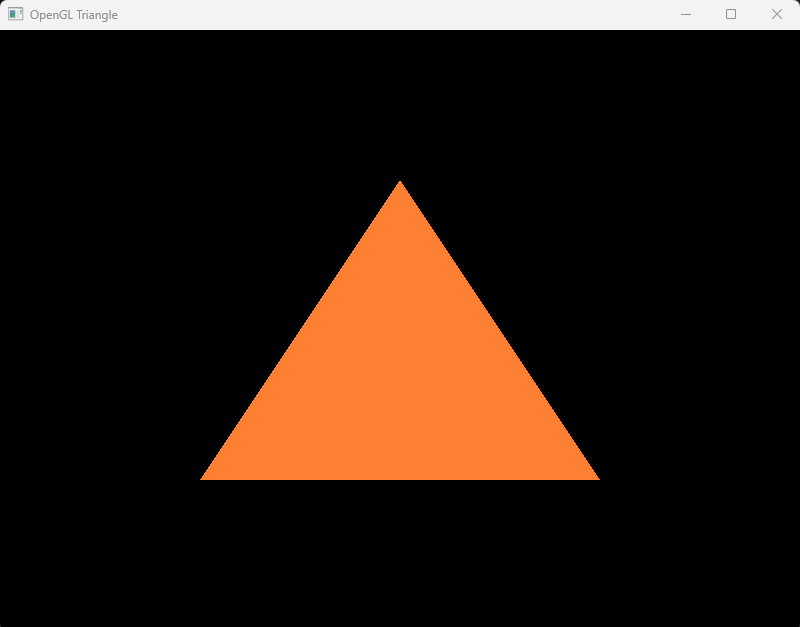

Just a simple triangle drawing by OpenGL.

# Build on Windows

Install dependencies. Use following (install `vcpkg` as a package manager and install libraries by vcpkg.):
```
git clone https://github.com/microsoft/vcpkg.git
cd vcpkg
./bootstrap-vcpkg.sh  # or .\bootstrap-vcpkg.bat on Windows
./vcpkg install glfw3 glew
```

You can use the following command to build the binary.
```sh
cmake -B build -S . -DCMAKE_TOOLCHAIN_FILE=[path_to_vcpkg]/scripts/buildsystems/vcpkg.cmake
cmake --build build
```

